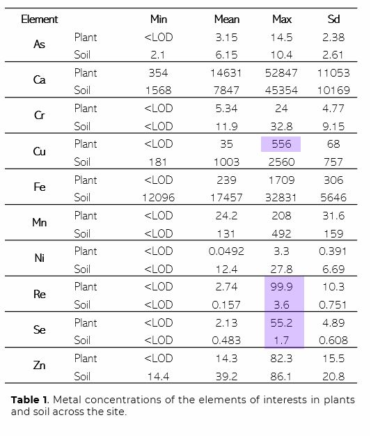

# **Data upload**

```{r setup, include=FALSE, warning=FALSE}
knitr::opts_chunk$set(echo = TRUE)

library(ggplot2)
library(dplyr)
library(data.table)
library(reshape2)
library(reshape)
library("readxl")
library(ggpubr)
library(agricolae)
library(lemon) #to nicely print the table 


setwd("C:/Users/twlodarczyk/OneDrive - University of Arizona/Desktop/All documents/1 PhD/CNRS + Synch/Field/Soltitude/Data")
dt <-read.delim("Solitude_Complete_List_3.6.23.txt")
knit_print.data.frame <- lemon_print

```

# **Time management**


```{r warning=FALSE}
```

# **ND removed, Converted to a Dataframe**

```{r warning=FALSE}

#replace ND with 0

tr <- matrix(data = NA, ncol = ncol(dt[,c(1:46)]), nrow=nrow(dt))
colnames(tr) <- colnames(dt[,c(1:46)])
for (i in 12:46)
{
  tr[,c(i)] <- gsub(".*ND.*", 0, dt[,i])
}

for(i in 1:11)
{
  tr[,c(i)] <- dt[,c(i)]
}
   

#transform to dataframe
tr <- as.data.frame.matrix(tr) #A correct command to change the dataset to dataframe after transformations
tr[,12:46] <- sapply(tr[,12:46],as.numeric) # Change a character to numeric (double)
typeof(tr$Cu_concentration) # confirm the value is no longer a character


```

# **Head of the dataset**

```{r caption="Data frame is now printed using `kable`.",render=lemon_print}
head(tr)
```

# **Subsets and wrangling**

```{r warning=FALSE}

#Filtering with tydeverse library
dt_plants <- filter(tr,  Scientific_Name != 'QA_Sample')

P1 <- filter(dt_plants, Plot == "P1")
P2 <- filter(dt_plants, Plot == "P2")
P5 <- filter(dt_plants, Plot == "P5")
P6 <- filter(dt_plants, Plot == "P6")
P125 <- filter(dt_plants, Plot != "P6")

Se_best <- subset(dt_plants, Scientific_Name == 'Isocoma cf. tenuisecta' | Scientific_Name == 'Populus fremontii' | Scientific_Name == 'Senegalia (Acacia) greggii' )

Re_best <- subset(dt_plants, Scientific_Name == 'Isocoma cf. tenuisecta' | Scientific_Name == 'Baccharis sarothroides' | Scientific_Name == 'Senegalia (Acacia) greggii'| Scientific_Name == 'Nultuma (Prosopis) velutina' | Scientific_Name == 'Mimosa biuncifera (=aculeaticarpa)' | Scientific_Name == 'Fraxinus velutina'| Scientific_Name == 'Datura wrightii' )


# Dropping uncertainty columns for PCA analysis

dt_plants_nounc = select(dt_plants, -Cl_uncertainty,-Ca_uncertainty, -Ti_uncertainty,
                         -Cr_uncertainty, -Mn_uncertainty, -Fe_uncertainty, -Ni_uncertainty, -Cu_uncertainty,
                         -Zn_uncertainty, -As_uncertainty, -Se_uncertainty, -Cd_uncertainty, -Re_uncertainty, -Hg_uncertainty, -Co_uncertainty,
                         -Tl_uncertainty, -Pb_uncertainty, -Substrate_RT)

dt_plants_nounc = select(dt_plants_nounc, -Hg_concentration, -Tl_concentration, -Pb_concentration, -Ni_concentration, -Co_concentration)


#Filtering plants By Plot with subset function

dt_plants_nounc1 <- subset(dt_plants_nounc, Plot=="P1")
dt_plants_nounc2 <- subset(dt_plants_nounc, Plot=="P2")
dt_plants_nounc5 <- subset(dt_plants_nounc, Plot=="P5")
dt_plants_nounc6 <- subset(dt_plants_nounc, Plot=="P6")
dt_plants_nounce15 <- subset(dt_plants_nounc, Plot=="P1" | Plot=="P5")
dt_plants_nounce125 <- subset(dt_plants_nounc, Plot=="P1" | Plot=="P5" | Plot=="P2")

#Removing _concentration from column names

colnames(dt_plants_nounce125)[12] <- "Cl"
colnames(dt_plants_nounce125)[13] <- "Ca"
colnames(dt_plants_nounce125)[14] <- "Ti"
colnames(dt_plants_nounce125)[15] <- "Cr"
colnames(dt_plants_nounce125)[16] <- "Mn"
colnames(dt_plants_nounce125)[17] <- "Fe"
colnames(dt_plants_nounce125)[18] <- "Cu"
colnames(dt_plants_nounce125)[19] <- "Zn"
colnames(dt_plants_nounce125)[20] <- "As"
colnames(dt_plants_nounce125)[21] <- "Se"
colnames(dt_plants_nounce125)[22] <- "Cd"
colnames(dt_plants_nounce125)[23] <- "Re"

colnames(dt_plants_nounc6)[12] <- "Cl"
colnames(dt_plants_nounc6)[13] <- "Ca"
colnames(dt_plants_nounc6)[14] <- "Ti"
colnames(dt_plants_nounc6)[15] <- "Cr"
colnames(dt_plants_nounc6)[16] <- "Mn"
colnames(dt_plants_nounc6)[17] <- "Fe"
colnames(dt_plants_nounc6)[18] <- "Cu"
colnames(dt_plants_nounc6)[19] <- "Zn"
colnames(dt_plants_nounc6)[20] <- "As"
colnames(dt_plants_nounc6)[21] <- "Se"
colnames(dt_plants_nounc6)[22] <- "Cd"
colnames(dt_plants_nounc6)[23] <- "Re"

```

# **Data Visualization**

## **Boxplots - Cu - All plots**

```{r warning=FALSE}

Cu_AllPlots<- ggplot(dt_plants, aes(x = reorder(Scientific_Name, Cu_concentration, FUN = median), y = Cu_concentration, group=Scientific_Name)) +
  geom_boxplot()+theme_classic()+theme(panel.grid.major = element_blank(), panel.grid.minor = element_blank(),axis.title.x=element_blank())+
  #theme(legend.position = "none")+
  scale_x_discrete(guide = guide_axis(angle = 0))+
  geom_jitter(aes(colour = Plot), size=1) +
  ylim(0,600)+
  coord_flip()+
  theme(axis.text.x = element_text(angle = 90, vjust = 0.5, hjust=1))
#scale_fill_manual(values = c("#38A6A5", "#73AF48", "#EDAD08", "#CC503E"))
Cu_AllPlots

```

## **Boxplots - Re - All Plots**

```{r warning=FALSE}
Re_AllPlots<- ggplot(dt_plants, aes(x = reorder(Scientific_Name, Re_concentration, FUN = median), y = Re_concentration, group=Scientific_Name)) +
  geom_boxplot()+theme_classic()+theme(panel.grid.major = element_blank(), panel.grid.minor = element_blank(),axis.title.x=element_blank())+
  #theme(legend.position = "none")+
  scale_x_discrete(guide = guide_axis(angle = 0))+
  geom_jitter(aes(colour = Plot), size=1) +
  #ylim(0,600)+
  coord_flip()+
  theme(axis.text.x = element_text(angle = 90, vjust = 0.5, hjust=1))
#scale_fill_manual(values = c("#38A6A5", "#73AF48", "#EDAD08", "#CC503E"))
Re_AllPlots

```

## **Boxplots - Re - Selected species**

```{r warning=FALSE}


Re_box <- ggplot(Re_best, aes(x = reorder(Scientific_Name, Re_concentration, FUN = median), y = Re_concentration, fill=Scientific_Name)) +
  geom_boxplot()+theme_classic()+theme(panel.grid.major = element_blank(), panel.grid.minor = element_blank(),axis.title.x=element_blank())+
  theme(legend.position = "none")+
  scale_x_discrete(guide = guide_axis(angle = 45))+
  geom_jitter(color="#85b8bc", size=2, alpha=0.9) +
  theme(axis.text.x = element_text(angle = 90, vjust = 0.5, hjust=1))+
  #scale_fill_manual(values = c("", "", "", "", "", "","" ))
  scale_fill_manual(values = c("#4b2866", "#c7abdd", "#a578c9", "#381e4c", "#8347b2", "#5d327f","#251433" ))
  #scale_fill_brewer(palette = "Greens")

Re_box

```

## **Boxplots - Zn - All Plots**

```{r warning=FALSE}

Zn_AllPlots<- ggplot(dt_plants, aes(x = reorder(Scientific_Name, Zn_concentration, FUN = median), y = Zn_concentration, group=Scientific_Name)) +
  geom_boxplot()+theme_classic()+theme(panel.grid.major = element_blank(), panel.grid.minor = element_blank(),axis.title.x=element_blank())+
  #theme(legend.position = "none")+
  scale_x_discrete(guide = guide_axis(angle = 0))+
  geom_jitter(aes(colour = Plot), size=1) +
  #ylim(0,600)+
  coord_flip()+
  theme(axis.text.x = element_text(angle = 90, vjust = 0.5, hjust=1))
#scale_fill_manual(values = c("#38A6A5", "#73AF48", "#EDAD08", "#CC503E"))
Zn_AllPlots

```

## **Boxplots - Se - All Plots**

```{r warning=FALSE}

Se_AllPlots<- ggplot(dt_plants, aes(x = reorder(Scientific_Name, Se_concentration, FUN = median), y = Se_concentration, group=Scientific_Name)) +
  geom_boxplot()+theme_classic()+theme(panel.grid.major = element_blank(), panel.grid.minor = element_blank(),axis.title.x=element_blank())+
  #theme(legend.position = "none")+
  scale_x_discrete(guide = guide_axis(angle = 0))+
  geom_jitter(aes(colour = Plot), size=1) +
  ylim(0,60)+
  coord_flip()+
  theme(axis.text.x = element_text(angle = 90, vjust = 0.5, hjust=1))
#scale_fill_manual(values = c("#38A6A5", "#73AF48", "#EDAD08", "#CC503E"))
Se_AllPlots

```

## **Boxplots - Se - Selected species**

```{r warning=FALSE}

Se_box <- ggplot(Se_best, aes(x = reorder(Scientific_Name, Se_concentration, FUN=median), y = Se_concentration, fill=Scientific_Name)) +
  geom_boxplot()+theme_classic()+theme(panel.grid.major = element_blank(), panel.grid.minor = element_blank(),axis.title.x=element_blank())+
  theme(legend.position = "none")+
  scale_x_discrete(guide = guide_axis(angle = 45))+
  geom_jitter(color="#85b8bc", size=3, alpha=0.9) +
  theme(axis.text.x = element_text(angle = 90, vjust = 0.5, hjust=1))+
  scale_fill_manual(values = c("#251433", "#c7abdd", "#8347b2"))
Se_box

```

## **Boxplots - Cu - Plot 6**

Plants collected at the plot 6 were growing directly on the mine tailings that were exposed on the area of 100 x 100 m. Shrubs were also collected in the close vicinity to the tailings given their rooting depths.


```{r warning=FALSE}

Cu_Plot6 <- ggplot(P6, aes(x = reorder(Scientific_Name, Cu_concentration, FUN = median), y = Cu_concentration, group=Scientific_Name)) +
  geom_boxplot()+theme_classic()+theme(panel.grid.major = element_blank(), panel.grid.minor = element_blank(),axis.title.x=element_blank())+
  #theme(legend.position = "none")+
  scale_x_discrete(guide = guide_axis(angle = 0))+
  geom_jitter(aes(colour = Plot), size=1.6) +
  ylim(0,600)+
  coord_flip()+
  theme(axis.text.x = element_text(angle = 90, vjust = 0.5, hjust=1))
  #scale_fill_manual(values = c("#38A6A5", "#73AF48", "#EDAD08", "#CC503E", "#38A6A5", "#73AF48", "#EDAD08", "#CC503E", "#38A6A5", "#73AF48", "#EDAD08"))
Cu_Plot6

```

# **Soil Table**



```{r warning=FALSE}


```

# **PCA Analysis**

## **Creating principal components**

```{r warning=FALSE}

require(stats)
myPr1 <- prcomp(dt_plants_nounc1[,12:23], scale=TRUE)
myPr2 <- prcomp(dt_plants_nounc2[,12:23], scale=TRUE)
myPr5 <- prcomp(dt_plants_nounc5[,12:23], scale=TRUE)
myPr6 <- prcomp(dt_plants_nounc6[,12:23], scale=TRUE)
myPr15 <- prcomp(dt_plants_nounce15[,12:23], scale=TRUE)
myPr125 <- prcomp(dt_plants_nounce125[,12:23], scale=TRUE) # it was not working because the scale was FALSE


```

## **Biplots1**

```{r warning=FALSE}

biplot(myPr1, scale=0)
biplot(myPr125, scale=0)

```

## **Biplots2 - Plot 1, 2 and 5**

```{r warning=FALSE}

biplot125 <- biplot(myPr125,
             col=c('blue', 'red'),
             cex=c(0.8, 0.8),
             xlim=c(-.4, .4),
             main='PCA Results',
             expand=1.2)


```

## **Biplots2 - Plot 6**

```{r warning=FALSE}
biplot6 <-  biplot(myPr6,
            col=c('blue', 'red'),
            cex=c(0.8, 0.8),
            xlim=c(-.4, .4),
            main='PCA Results',
            expand=1.2)

```

## **Bind dataframes with PC1 and PC2 for each plot**

```{r warning=FALSE}

dt_plants1 <- cbind(dt_plants_nounc1, myPr1$x[,1:2])
dt_plants2 <- cbind(dt_plants_nounc2, myPr2$x[,1:2])
dt_plants5 <- cbind(dt_plants_nounc5, myPr5$x[,1:2])
dt_plants6 <- cbind(dt_plants_nounc6, myPr6$x[,1:2])
dt_plants15 <- cbind(dt_plants_nounce15, myPr15$x[,1:2])

```

## **PCA All plots**

```{r warning=FALSE}

# Plot for all plot
myPr_all <- prcomp(dt_plants_nounc[,12:23], scale=TRUE)
dt_plants_all <- cbind(dt_plants_nounc, myPr_all$x[,1:2])

ggplot(dt_plants_all, aes(PC1, PC2, col=Plot, fill=Plot))+
  stat_ellipse(geom="polygon", col="black", alpha=0.5)+
  theme_classic()+
  geom_point(shape=21, col="black")


```

## **Variances across principle components**

```{r warning=FALSE}

plot(myPr125, type="l")

summary(myPr1)
```

# **Partial Least Square Discriminant Analysis (PLS-DA)**

```{r warning=FALSE}
library(readr)
library(dplyr)
library(tidyr)
library(ropls)


dt_plants_nounc_3 <- dt_plants_nounc |> select(-Scientific_Name, -Group, -Plot, -Sample_Name, -Tube_No, -Type_of_Sample, -Cup_No, -pXRF_measurement_ID, -ICP, -Material)

typeof(dt_plants_nounc_3$Total_Weight)
dt_plants_nounc_3[,1] <- sapply(dt_plants_nounc_3[,1],as.numeric)

dt_nounc_PCA <- opls(x=dt_plants_nounc_3)
plot(dt_nounc_PCA)


plot(dt_nounc_PCA, typeVc ="x-score", parAsColFcVn=dt_plants_nounc$Plot)
dt_opls <-opls(dt_plants_nounc_3, dt_plants_nounc$Plot)

summary(dt_opls)
```

##PCA

```{r warning=FALSE}

plot(dt_nounc_PCA, typeVc ="x-score", parAsColFcVn=dt_plants_nounc$Cu)
dt_opls <-opls(dt_plants_nounc_3, dt_plants_nounc$Cu)


```

# **Redundancy Analysis (RDA) Biplot**

```{r warning=FALSE}
dt_plants_trimmed <- dt_plants[c(-2,-4,-5,-6,-8,-10,-11, -24, -25, -40, -41, -42, -43, -44, -45, -seq(11,45,by=2))]
dt_plants_trimmed[,3] <- sapply(dt_plants_trimmed[,3],as.numeric)
library(vegan)

# Create a matrix of the environmental variables (columns 5 to 18)
env_mat <- as.matrix(dt_plants_trimmed[,5:18])

# Create a data frame of the response variables (weight and thickness)
resp_df <- data.frame(weight = dt_plants_trimmed[,3], thickness = dt_plants_trimmed[,18])

# Perform RDA
rda_result <- rda(env_mat, resp_df)

# Print the RDA results
summary(rda_result)

#Plot
# Plot the RDA biplot
plot(rda_result, scaling = 3)

# Add labels to the plot
text(rda_result, display = "species", col = "blue", cex = 0.8) #species - environmental variales
text(rda_result, display = "sites", col = "red", cex = 0.8) # the sites - response variables 

# Add a title to the plot
title(main = "Redundancy Analysis (RDA) Biplot")

```
